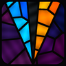

[//]: # ( ---------------------------------------------------------------------- )
[//]: # (+ Authors: 	Ran# <ran.hash@proton.me> )
[//]: # (+ Created: 	2026/04/27 10:48:03.565778 )
[//]: # (+ Revised: 	2026/04/29 07:20:32.795173 )
[//]: # ( ---------------------------------------------------------------------- )



# Vitralis

> *Vitralis* — from Latin *vitreus*, of glass. A surface that is there without being in the way.

Your screen, with memory.

Draw annotations, shapes, and marks directly over your live desktop. They stay — across sessions, across reboots — until you decide to remove them. The rest of the time, the overlay is invisible to your mouse: click through it as if it weren't there.

## Features

- Transparent, always-on-top overlay spanning all monitors
- Always click-through — use your computer normally at all times
- Drawing activated via a small floating toolbar; finishes automatically after each stroke
- Tools: freehand pen, eraser, rectangle, ellipse, line, arrow
- Color palette with custom color picker and stroke size control
- Per-stroke undo and click-to-delete individual strokes
- Pan mode — drag all drawings to reposition them
- Drawings persist across restarts (JSON stroke list, per-monitor)
- Show/hide overlay without losing drawings
- System tray icon — lives quietly in the background

## Setup

```
uv sync
```

## Usage

```
uv run vitralis
```

Or directly:

```
uv run python -m vitralis
```

## Keyboard shortcuts

### Global (work from any app)

| Key | Action |
|---|---|
| `F8` | Focus/unfocus Vitralis toolbar — restores previous window on unfocus |

### Local (when Vitralis is focused)

| Key | Action | Key | Action |
|---|---|---|---|
| `D` | Toggle draw mode | `P` | Pen |
| `G` | Toggle pan mode | `E` | Eraser |
| `X` | Toggle delete mode | `L` | Line |
| `Z` | Undo last stroke | `A` | Arrow |
| `Del` | Clear all | `R` | Rectangle |
| `H` | Hide/show overlay | `O` | Ellipse |
| `[` / `]` | Decrease / increase size | `Right-click` | Exit active mode |
| `Esc` | Quit if idle | `Ctrl+Q` | Quit |

## TODO

- Save and load named overlay snapshots (export/import stroke sets by name)
- Settings window (accessible from toolbar): custom keyboard shortcuts and UI language
- Focus indicator: toolbar shows a visual toggle/light indicating whether Vitralis currently has OS focus

## License

[PayBack License (PBL)](LICENSE) — free for personal, academic, and non-commercial use. Commercial use requires a revenue-share agreement with the author. See [LICENSE](LICENSE) for full terms.
